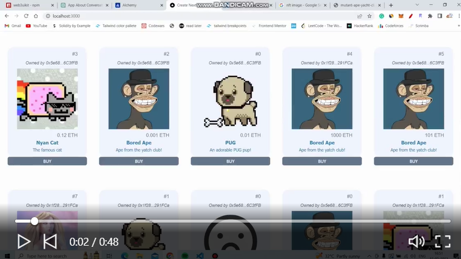

# Decentralized NFT marketplace

[See Live Demo of the dApp](https://www.linkedin.com/posts/bhimgouda-patil-05a254269_solidity-100daysofcode-activity-7062796065879592962-YMmf?utm_source=share&utm_medium=member_desktop)

- Anyone can list their NFTs.
- Anyone can buy the listed NFTs.
- Sellers can withdraw their earnings.
- Additionally, sellers can delist or update their NFT listings.
Although it doesn't have the best UI/UX, it gets the job done.

### So how does all this work? 🙃 

----------It has 3 main pieces to it---------
1. Backend Smart contract - The Backbone
2. Centralized Backend Server - Handles event indexing
3. Frontend App - For clients to interact with the dApp

As long as you have some Sepolia ETH in your wallet, you are all set to interact with the dApp.

[Check Verified Contracts of this dApp on Sepolia testnet](https://sepolia.etherscan.io/address/0xd6781F9a27C4FA946ED293A188009a36021F92Ab)
